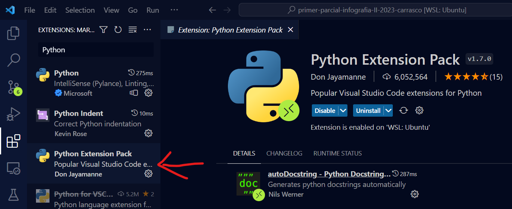
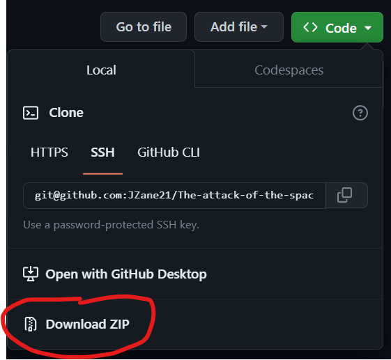
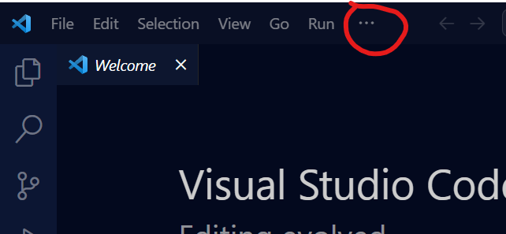
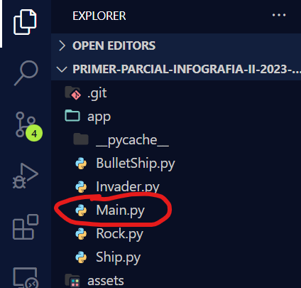
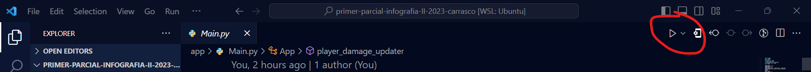
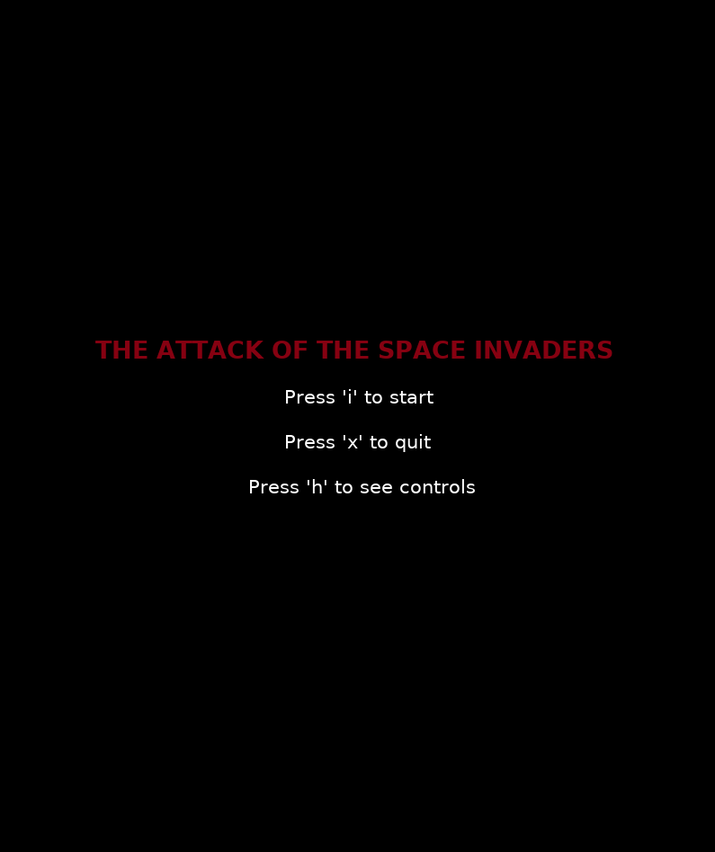
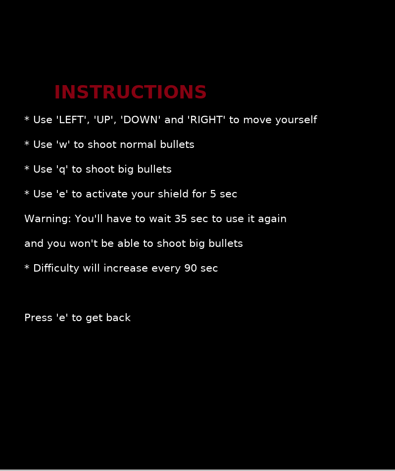
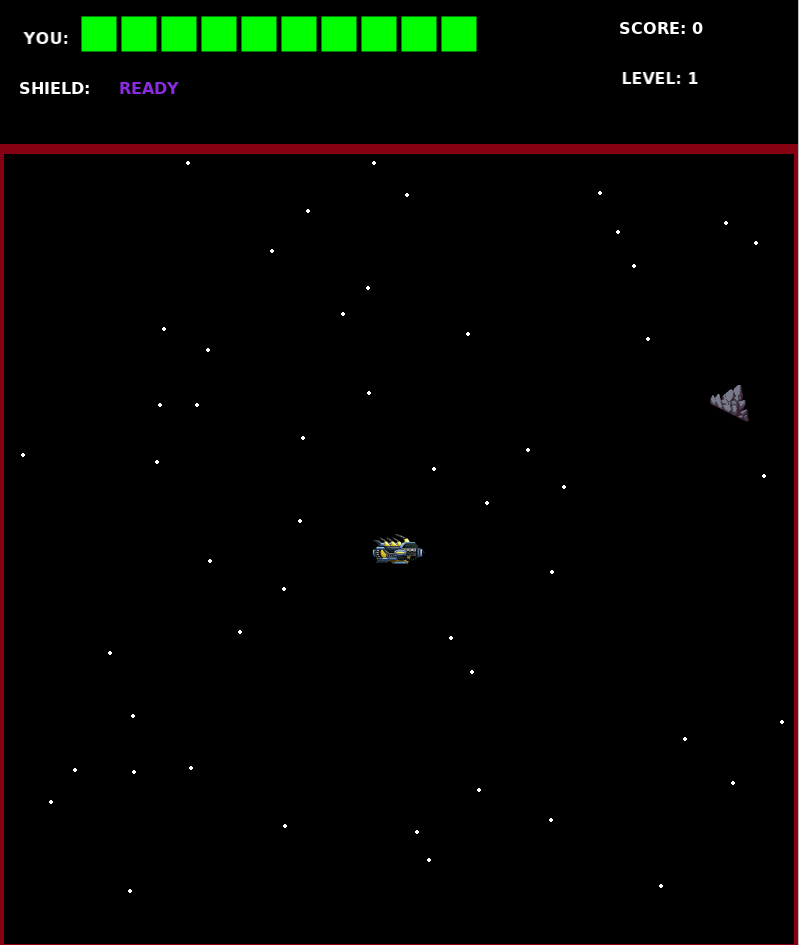
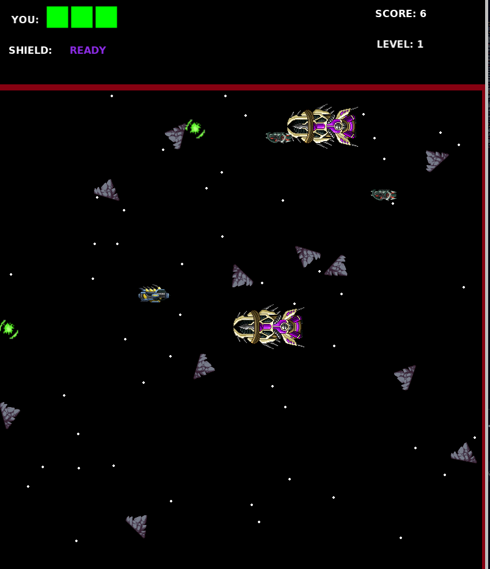
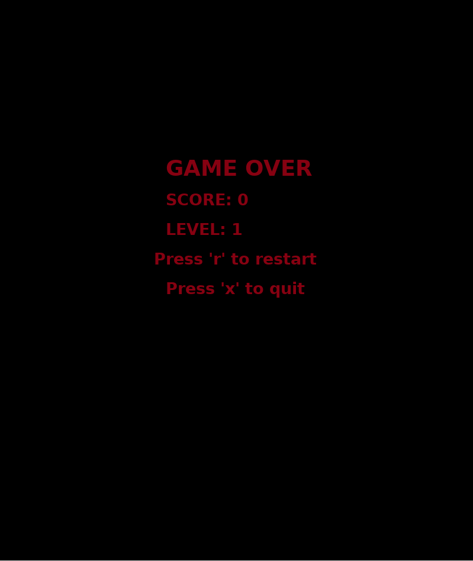

# Proyecto de Infografía - Primer Parcial

## Datos del estudiante:

- **Nombre :** José Samuel Carrasco Encinas
- **Carrera :** Ingeniería de Sistemas Computacionales
- **Código de Estudiante :** 63003

## Dependencias e Instalación:

Para lograr correr el programa, se deben instalar las siguientes dependencias:

- Python (la versión 3.10.12 en lo posible)
- Pip
- Arcade
- Visual Studio Code
- Windows 10 o 11

**Nota :** La dependencia Pip y Arcade puede llevarlo a realizar la instalación de estas dos herramientas por medio de la terminal. Así que se le irá informando más adelante sobre como instalarlas.

Además de ello, deberá instalar las siguientes dependencias en Visual Studio Code una vez terminada su instalación:

Una vez instaladas estas dependencias, se deben seguir los siguientes pasos para ejecutar el programa:

- Use el este [enlace](https://github.com/JZane21/The-attack-of-the-space-invaders), para descargar el proyecto

- Descargar el archivo comprimido, el cual se muestra en la siguiente imagen:

- Luego debe Crear una carpeta nueva en el directorio de su preferencia

- Colocar el archivo comprimido en la carpeta creada

- Descomprimir el archivo

- Ingresar al nuevo directorio que se generó al descomprimir el archivo.zip

- Debe hacer click derecho y debe abrir la carpeta con Visual Studio Code

- Una vez abierto el editor, usted debe abrir una terminal con las opciones que le aparecen en la parte superior de la pantalla:

Debe seleccionar la opción **terminal**, luego debe seleccionar **nueva terminal**

- Una vez abierta la terminal, ya puede instalar las dependencias previamente mencionadas (Arcade y Pip). Para ello, puede seguir la siguiente [documentación](https://api.arcade.academy/en/latest/examples/platform_tutorial/step_01.html?highlight=pip%20install#installation) ([opción dos](https://api.arcade.academy/en/latest/install/windows.html))

- Luego de instalar las herramientas ya mencionadas, se deben ejecutar los siguientes comandos para iniciar el juego:

  - cd app

  - python Main.py (En caso de que no funcione esta opción, puede intentar con **python3 Main.py**. Y si sigue sin funcionar, puede revisar su versión de Python con **python --version**, con el fin de verificar que su versión sea 3.10 o superior. Caso contrario, intente instalar una versión de Python y Pip nuevamente).

  - De igual forma, puede ejecutar el archivo usando Visual Studio Code. Para lograrlo, usted debe seleccionar el siguiente archivo:

  

  - Luego, usted debe seleccionar la flecha al lado del botón **play** en la parte superior derecha:

  

  - Y debe selecciona la opción de **Correr archivo Python** o **Run Python File**

**¡Y Listo!**

## Descripción del Videojuego

El siguiente videojuego, trata de controlar una nave espacial, con el fin de esquivar obstáculos y derrotar enemigos, con el fin de lograr acumular el mayor puntaje posible.

La forma en que uno puede interactuar con el juego, se lo indica en la pantalla de inicio del mismo:

- Presione **i** para inicar el juego
- Presione **x** para salir del juego
- Presione **h** para ver las instrucciones del juego y como jugarlo

Al introducirse en las instrucciones del juego, es posible ver las siguientes indicaciones:

- Debe usar las **flechas** de su teclado para moverse a arriba, abajo, izquierda o derecha.

- Para disparar balas normales, debe presionar **w**.

- Para disparar balas grandes, debe presionar **q**.

- Para protegerse con un escudo por 5 segundos, debe presionar **e**.

**Nota :** Mientras este usando el escudo, no podrá disparar balas grandes. Además de ello, el escudo no lo protegerá si choca con algún enemigo. Y el tiempo de recarga de este es de 35 segundos.

- El nivel y la dificultad aumentarán cada 90 segundos.

Al iniciar el juego, usted podrá interactuar con la nave presentada a continuación:

Usted debe moverse y atacar en lo más posible, con el fin de evitar ser destruido y ganar la mayor cantidad posible de puntos.

Sin embargo, aunque pierda, usted puede volver a jugar, o salir del juego. Y por supuesto, ver el puntaje que logró alcanzar, además de ver hasta que nivel de difucultad logró llegar.

